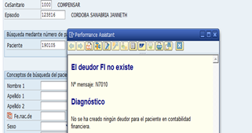

| Versión: 01       | ERRORES CONOCIDOS                   | 
|-------------------|-------------------------------------|
| Fecha: 27/03/2020 | SWPR168-FUNCIONALIDADES PROVEEDORES |

| Fecha                                                                                      | Descripción de la modificación                          |
|--------------------------------------------------------------------------------------------|---------------------------------------------------------|
| 05/05/2020                                                                                 | Versión Inicial                                         |
| 27/07/2020                                                                                 | Se anexan errores conocidos de no obligados.            |
| 04/08/2020                                                                                 | Se anexa error conocido de no obligados.                |
| 06/09/2021                                                                                 | Se anexan errores conocidos de descuentos financieros.  |
| 21/09/2021                                                                                 | Se anexa error conocido de navegador internet Explorer. Los errores conocidos presentes en este documento deben ser atendidos por soporte nivel 1.|

- [FUNCIONALIDADES PROVEEDORES](#funcionalidades-proveedores)
  - [1.	CONSULTAR ORDEN DE COMPRA](#1consultar-orden-de-compra)
    - [Consulta Órdenes de Compra Rango de Fechas](#consulta-órdenes-de-compra-rango-de-fechas)
    - [Consulta Órdenes de Compra por Orden de Compra](#consulta-órdenes-de-compra-por-orden-de-compra)
    - [PDF Orden de Compra](#pdf-orden-de-compra)
  - [2.	CONSULTAR RECIBO A SATISFACCIÓN (RAS) O INGRESO DE MATERIALES](#2consultar-recibo-a-satisfacción-ras-o-ingreso-de-materiales)
  - [3.	EXTRACTO PROVEEDOR](#3extracto-proveedor)
  - [4.	VENTANAS EMERGENTES](#4ventanas-emergentes)
  - [5.	RADICAR FACTURA - FORMULARIO NO OBLIGADOS](#5radicar-factura---formulario-no-obligados)
    - [Campos obligatorios](#campos-obligatorios)
    - [Adjuntos obligatorios](#adjuntos-obligatorios)
    - [Navegador compatible](#navegador-compatible)
  - [6.	DESCUENTOS FINANCIEROS](#6descuentos-financieros)
    - [Mensajes de información](#mensajes-de-información)
    - [Mensajes de error](#mensajes-de-error)
# FUNCIONALIDADES PROVEEDORES

Los errores conocidos expuestos en el presente documento hacen referencia a validaciones de nivel 1 que debe realizar la mesa de ayuda, en caso de persistir el error se debe escalar a nivel 2 que para estos casos es el ULA de la aplicación, quien hará las validaciones pertinentes y dará solución de ser posible, de igual manera determinará a quien debe escalar de ser necesario.

## 1.	CONSULTAR ORDEN DE COMPRA

### Consulta Órdenes de Compra Rango de Fechas
Los usuarios podrán consultar órdenes de compra en un rango de fechas menor o igual a tres meses.

Las consultas realizadas por rango de fechas retornan los campos de *Total IVA, Total Impoconsumo y Total Orden* en blanco como se muestra en la siguiente imagen.

### Consulta Órdenes de Compra por Orden de Compra

Los usuarios únicamente podrán consultar las órdenes de compra que se encuentren asociadas al proveedor que inicio sesión en transar.

### PDF Orden de Compra

Los valores de cantidad de pedido se visualizarán sin posiciones decimales en el sitio.
 

## 2.	CONSULTAR RECIBO A SATISFACCIÓN (RAS) O INGRESO DE MATERIALES

Los usuarios podrán consultar el número de Recibo a Satisfacción de las Órdenes de Compra, una vez el solicitante realice el ingreso o aceptación en el ERP SAP.

## 3.	EXTRACTO PROVEEDOR

Los usuarios podrán consultar el extracto por un rango de fechas máximo de tres meses.

Los usuarios podrán consultar el extracto histórico con máximo un año de antigüedad.

## 4.	VENTANAS EMERGENTES

El usuario debe mantener activas las ventanas emergentes del sitio.

## 5.	RADICAR FACTURA - FORMULARIO NO OBLIGADOS
### Campos obligatorios
Los usuarios deberán anexar el número de factura que se encuentra en la representación gráfica de esta en el campo *No.Factura* para que el aplicativo permita continuar con el proceso de radicación.

Los usuarios deberán seleccionar el tipo de documento correspondiente (*Factura, cuenta de cobro, nota crédito, nota débito*) en el campo Tipo de documento para que el aplicativo permita continuar con el proceso de radicación.

Los usuarios deberán seleccionar por lo menos una autorización de pago u orden de compra según el tipo de radicación que se encuentre realizando en la pestaña *Autorización de pago/Entradas de orden de compra¨* para que el aplicativo permita continuar con el proceso de radicación, adicionalmente solo se podrá agregar una vez la autorización correspondiente y deben coincidir el tipo de moneda (Pesos colombianos, Dólar, Euros).

En los casos de radicación de factura con destino, el usuario debe anexar el tipo de moneda (Peso Colombiano, Dólar o Euro) con base en el tipo de moneda que se encuentra en la representación gráfica de la factura para que el aplicativo permita continuar con el proceso de radicación.

Para el escenario de radicación orden de compra no cedi, en la sección **ORDENES DE COMPRA** el sistema solo permite añadir órdenes de compra que se encuentren liberadas y que pertenezcan al proveedor.

Para el escenario de radicación autorizaciones de pago, el sistema propone el siguiente mensaje cuando no se encuentren autorizaciones de pago asociadas al proceso seleccionado.

### Adjuntos obligatorios

Los usuarios deben anexar los soportes de facturación (Factura/Cuenta de cobro y soportes) para generar una radicación exitosa.

Los usuarios deben anexar los soportes en formato PDF y un tamaño máximo de 2 MB por documento.

Los soportes que no se encuentren en formato .pdf no se cargarán al aplicativo.

### Navegador compatible

Los usuarios deben acceder a la funcionalidad de radicar factura con los navegadores Google Chrome o Mozilla Firefox para que todos los componentes carguen correctamente.

No se recomienda utilizar Internet Explorer ya que no se encuentra soportado por Microsft y por esta razón pueden fallar elementos de SAPUI5. 

## 6.	DESCUENTOS FINANCIEROS

### Mensajes de información

| ID Del Mensaje | Mensaje                                               | Transacción                                  | Descripción                                                                                                                                                                          | Especificación del Mensaje                                                                              | Solución                                                                                                                                           |
|----------------|-------------------------------------------------------|----------------------------------------------|--------------------------------------------------------------------------------------------------------------------------------------------------------------------------------------|---------------------------------------------------------------------------------------------------------|----------------------------------------------------------------------------------------------------------------------------------------------------|
| MINFO_001      | Este servicio requiere Remitente (Talleres Grupales)  | NR16                                         | Este mensaje indica que al realizar el agendamiento la cita no se colocó el VMA del Médico en el campo Med.Transfiere                                                                |  En la imagen se muestra como se debe asignar el Médico que transfiere                                   | Al realizar el agendamiento en la pantalla donde se muestran los datos de la cita se debe colocar el vma del médico que transfiere o un VMA válido |
| MINFO_002      | Error este servicio requiere Remitente( Laboratorios) | NV2000                                       | Este mensaje indica que al realizar la admisión de laboratorios no se colocó el VMA del Med:Remitente                                                                                |   En la imagen se muestra cómo se debe asignar el médico tratante para corregir el error de tratante      | Al realizar el Admisión en la pestaña Datos de Consulta se debe colocar el vma del médico remitente o un VMA Válido                                |
| MINFO_003      |      Ya tiene Cita Asignada                                                  | NR16/NV2000                                  | Este mensaje indica que al realizar la admisión, SSAS generó la autorización pero en SAP no la Mostró                                                                                |      En la imagen se muestra como se debe asignar seleccionar la autorización que fue generada para ese CUPS                                                                                                    | Al realizar el Admisión en el recuadro donde muestra la autorización se busca el cups que muestra el error y se selecciona la autorización         |                                            |
| MINFO_004      | Fechas de pago                                        | BPM_Descuentos Financieros - Usuario Externo | El mensaje desplegado en el visor de descuentos indica que la fecha seleccionada por el usuario no corresponde a un día hábil y el sistema propone el siguiente día hábil disponible |                                                                                                         | Seleccionar una fecha válida o tomar la que propone el sistema                                                                                     | 
| MINFO_005      | Términos y condiciones                                | BPM_Descuentos Financieros - Usuario Externo | El mensaje desplegado en el visor de descuentos muestra los términos y condiciones al generar la solicitud de pronto pago con descuento                                              |                                                                                                         | Aceptación del mensaje                                                                                                                             |
| MINFO_006      | Número de caso BPM generado                           | BPM_Descuentos Financieros - Usuario Externo | El mensaje desplegado en el visor de descuentos indica el consecutivo del caso generado                                                                                              |                                                                                                         | Aceptación del mensaje                                                                                                                             |

 

### Mensajes de error

| ID Del Mensaje | Mensaje                                                                                                | Transacción                                  | Descripción                                                                                                                                                                                                                                                                                              | Especificación del Mensaje                                                                                                                         | Solución                                                                                                                                                                                                                                                                                                                                                                                                   |
|----------------|--------------------------------------------------------------------------------------------------------|----------------------------------------------|----------------------------------------------------------------------------------------------------------------------------------------------------------------------------------------------------------------------------------------------------------------------------------------------------------|----------------------------------------------------------------------------------------------------------------------------------------------------|------------------------------------------------------------------------------------------------------------------------------------------------------------------------------------------------------------------------------------------------------------------------------------------------------------------------------------------------------------------------------------------------------------|
| MERRO_001      |                                                                                   | NR16/NV2000                                  | Este mensaje indica que al realizar el agendamiento y/o admisión el sistema valida el número de celular y si este tiene Menos de 10 o más de 10 Dígitos genera el error mencionado                                                                                                                       |  En la imagen se muestra que al celular le hace falta un número solo tiene 9 dígitos                                                                                       | Ingresar a la TX NV2000, y corregir el número de celular ya que  le puede sobrar o faltar un número                                                                                                                                                                                                                                                    |
| MERRO_002      | Error Fecha de inicio debe ser diligenciada                                       | NV2000                                       | Este mensaje indica que al realizar la admisión no se ingreso a la Pestaña Datos de Consulta                                                                                                                                                                                                             |  En la imagen se muestra el erro al momento de realizar la admisión y que no se seleccionó la pestaña datos de consulta para dar inicio al episodio                        | Siempre se debe seleccionar la pestaña Datos de Consulta para activar la fecha de Inicio del Episodio                                                                                                                                                                                                                                                  |
| MERRO_003      | Error  No se encontró Estrato: . Prestaciones  de SAP Enterprise                  | NV2000                                       | Este error aunque no se ve directamente en la pantalla del usuario al momento de enviar las prestaciones a Enterprise genera error.                                                                                                                                                                      |                                    En la imagen se evidencia que el Campo Clase de Cobertura no lo diligenciaron                                                                                                                                    | Si al Validar en Enterprise las prestaciones no llegaron, se debe seleccionar la clase de cobertura y realizar nuevamente el envío                                                                                                                                                           |
| MERRO_004      | Error "Teléfono contiene caracteres especiales"                                   | NV2000                                       | Este error aunque no se ve directamente en la pantalla del usuario al momento de enviar las prestaciones a Enterprise genera error.                                                                                                                                                                      |  En esta imagen se evidencia que en el Campo teléfono se encuentran letras                                                                                                 | Si al Validar en Enterprise las prestaciones no llegaron se debe revisar los datos del paciente al momento de realizar la admisión de los laboratorios y modificarlo por caracteres numéricos                                                                                                                                                          |
| MERRO_005      | Error "Formato de Teléfono erróneo"                                               | NV2000                                       | Este error aunque no se ve directamente en la pantalla del usuario al momento de enviar las prestaciones a Enterprise genera error.                                                                                                                                                                      |  En esta imagen se evidencia que en el Campo teléfono se encuentra un Cero                                                                                                 | Si al Validar en Enterprise las prestaciones no llegaron se debe revisar los datos del paciente al momento de realizar la admisión de los laboratorios y modificar el teléfono por un número Válido                                                                                                                                                    |
| MERRO_006      | Error Sede 10X(Error Descripción sede Cápita)                                     | NV2000                                       | Este error aunque no se ve directamente en la pantalla del usuario al momento de enviar las prestaciones a Enterprise genera error.                                                                                                                                                                      |  En esta Imagen se evidencia que la Columna UO MedSolic y UO Gestora se está yendo como virtual (X)                                                                        | Al realizar  admisión de laboratorios en donde existan campos  relacionados con sede debe quedar con la sede real tanto los datos de la pestaña Datos de Consulta como en la pestaña Prestaciones                                                                                                                                                      |
| MERRO_007      | Error "Debe confirmar cambios para ejecutar esta acción"                          | NWP1                                         | Este error se genera al momento de guardar registrar los antecedentes y seleccionar el botón de Guardar                                                                                                                                                                                                  |                                   En esta imagen se evidencia que al momento de guardar le generó error que se debe confirmar cambios                                                                                                                                         | Se debe ingresar a antecedentes, se selecciona el botón CONFIRMAR cambios y posteriormente guardar .                                               |
| MERRO_008      | Error "Revisar relación de Diagnóstico, finalidad de la consulta y causa externa"                      | NWP1                                         | Este error se genera al momento de seleccionar la Finalidad de la consulta que no corresponde con la causa Externa                                                                                                                                                                                       |  Esta Imagen representa Cuando se selecciona la finalidad de la consulta y la Causa Externa es errónea                                              | Se debe seleccionar la FINALIDAD DE LA CONSULTA y CAUSA EXTERNA,  según corresponda el DX O si es PYP.  1. Se debe tener en cuenta que si la FINALIDAD de la consulta s diferente a NO Aplica, la CAUSA EXTERNA es Otra  2. Si el Diagnóstico empieza por Z La finalidad de la consulta es NO Aplica y la Causa Externa OTRA  3. Si el DX es diferente a Z la Causa Externa es Enfermedad General |
| MERRO_009      | Error Diagnóstico no previsto para sexo Femenino Error Diagnóstico no previsto para sexo Masculino | NWP1                                         | Este error se genera al momento de seleccionar un Diagnóstico que no aplica al Sexo del paciente                                                                                                                                                                                                         |  En esta imagen se evidencia el momento en el que a un paciente de Sexo femenino se selecciona un DX de sexo Masculino                              | para imprimir la incapacidad se debe seleccionar el registro a imprimir y se debe seleccionar el pulsador mostrar Datos                                                                                                                                                                                                                                                                                    |
| MERRO_010      | Error La fecha de Inicio de Incapacidad no puede ser anterior a la de ingreso                          | NWP1                                         | Este error se genera al momento de registrar la incapacidad  cuando la fecha es menor a la fecha de ingreso                                                                                                                                                                                              |                                   En esta imagen se evidencia  que la fecha de inicio de la incapacidad es errónea                                                                                                                  | Al momento de diligenciar la incapacidad se debe tener en cuenta la fecha ingreso o Registro y la fecha de Inicio de la incapacidad                                                                                                                                                                                                                                                                        |
| MERRO_011      | Error Existen Datos que no se han registrado                                                           | NWP1                                         | Este error se presenta al momento de diligenciar la incapacidad no se han confirmado datos                                                                                                                                                                                                               |                                 En esta imagen se evidencia que no se seleccionó el botón de registrar datos al guardar la incapacidad                                                                                                                    | Al momento de diligenciar la incapacidad Se debe registrar datos para que ésta se pueda guardar                                                                                                                                                                                                                                                                                                            |
| MERRO_012      | Error Para imprimir se debe seleccionar  un registro y visualizar                                      | NWP1                                         | Este error se presenta al momento de Imprimir una incapacidad si no se ha seleccionado el registro a imprimir                                                                                                                                                                                            |          En esta Imagen se evidencia que no se seleccionó ni se pulsó el botón de mostrar datos en el registro de la incapacidad                                                                                                                                          | Para imprimir la incapacidad se debe seleccionar el registro a imprimir y se debe seleccionar el pulsador mostrar Datos                                                                                                                                                                                                                                                                                    |
| MERRO_013      | Error Rango de Fechas de la Incapacidad se solapa con otras incapacidades                              | NWP1                                         | Este error se presenta al momento de diligenciar una incapacidad con la misma fecha de registro, la misma fecha de inicio de la incapacidad de otra ya registrada                                                                                                                                        |                         Esta imagen se evidencia el error que genera al intentar registrar dos incapacidades con la misma fecha de inicio                                                                                                                            | Si se va a registrar una nueva incapacidad debe tener diferente fecha de inicio y los días no deben  sobreponerse a    las que se encuentran registradas                                                                                                                                                                                                                                                   |
| MERRO_014      | Error debe asignar un Diagnóstico                                                                      | NWP1                                         | Este error se presenta cuando se crea una Orden Clínica y no se carga el Diagnóstico diligenciado en la Historia Clínica                                                                                                                                                                                 |                 Esta alerta se presenta al crear la orden clínica y se selecciona guardado Pendiente de Firma , el sistema realiza la validación de que el Diagnóstico debe estar cargado                                                                                                                                   | Se debe cargar el Diagnóstico diligenciado en la Historia Clínica                                                                                                                                                                                                                                                                                                                                          |
| MERRO_015      | El medicamento xxxx requiere indicaciones                                                              | NWP1                                         | Este error se presenta al formular medicamentos no POS y que no se le ha diligenciado las indicaciones                                                                                                                                                                                                   |             En esta imagen se evidencia que no se han diligenciado las indicaciones de Medicamentos no POS                                                                                                                                        | Se debe Diligenciar las indicaciones del Medicamentos NO POS y  se da clic en el Botón Planificar  para continuar con la formulación                                                                                                                                                                                                                                                                       |
| MERRO_016      | Error Deudor FI no existe                                                                              | NE11                                         | Este error se presenta al momento de realizar las facturación de un episodio sin haber habilitado la Aseguradora Particular del Paciente                                                                                                                                                                 |                                                                                                En esta imagen se evidencia el mensaje que genera el sistema al realizar la Facturación                                                     | Se debe ingresar al episodio y verificar en la pestaña de Relación Aseguradora se encuentra activa la Aseguradora Particular y consumir nuevamente la Autorización                                                                                                                                                                                                                                         |
| MERRO_017      | No se encontraron Parámetros para los datos Ingresados                                                 | /IBMISHC/FI_002                              | Este error se presenta al momento de realizar la devolución de un episodio ya recaudo, al momento de bloquear el episodio no se seleccionó el motivo del bloqueo en este caso 01 que son episodios ambulatorios, o al ingresar a la /IBMISHC/FI_002   se seleccionó copago y era un anticipo o viceversa |            En esta imagen se evidencia el error al realizar la devolución                                                                                                                                         | 1. Se debe ingresar a la  transacción de bloqueo S_KK4_96000132 y validar si al momento que se realizó el bloqueo del episodio se diligenció el motivo, de lo contrario se debe desbloquear el episodio y bloquearlo nuevamente con los datos correctos.                                           2.Se debe verificar que al ingresar a la Transacción  /IBMISHC/FI_002  se seleccionó correctamente copago o anticipo.                                                                                                        |
| MERRO_018      | No se encontró impresora Zebra                                                                         | BPM_Radicación facturas proveedor            | La impresora no está configurada o encendida                                                                                                                                                                                                                                                             |              Esta imagen muestra cuando el BPM de Radicación facturas proveedor en la etapa inicial no reconoce la impresora Zebra                                                                                                                                       | Realizar la instalación de los controladores de la impresora.                                           Revisar que la impresora se encuentre conectada y encendida.                                                                                                                                                                                                                                                                                        |
| MERRO_019      | No se pudo cargar los datos de la tarea                                                                | BPM_Transversal                              | Ese error es causado por problemas del chache del navegador.                                                                                                                                                                                                                                             |                  Esta imagen muestra cuando el BPM no carga la información de la tarea en el formulario una vez se ingresa al caso.                                                                                                                                   | Oprimir simultáneamente las teclas Ctrl y F5                                                                                                                                                                                                                                                                                                                                                               |
| MERRO_020      | La tarea no se pudo reservar                                                                           | BPM_Transversal                              | Hay tareas que son asignadas a grupos, por ejemplo a un grupo con 3 usuarios, el usuario X abre la tarea y en seguidas el usuario Y la intenta abrir. Hubo alguna intermitencia en la red o el servicio de PO está indisponible                                                                      |                     La imagen muestra el mensaje del error cuando la tarea no se puede reservar                                                                                                                                | Refrescar la bandeja del BPM y la tarea desaparecerá. Caso no desaparezca haga un nuevo intento. Verificar si hay red, caso no haya contactar el personal responsable. Verificar si el servicio de PO está disponible, en caso de que no, contactar los basis.                                                                                                                                 |
| MERRO_021      | La tarea ya se encuentra en estado final                                                               | BPM_Transversal                              | La tarea ya fue procesada por un usuario y hubo un reintento de procesarla, por el mismo usuario o por otro.                                                                                                                                                                                             | NO se tiene imagen del error                                                                                                                       | Refrescar la bandeja del BPM y con eso la tarea desaparecerá.                                                                                                                                                                                                                                                                                                                                              |
| MERRO_022      | Las ayudas de búsqueda no funcionan                                                                    | BPM_Transversal                              | Sesión expirada o inactiva.                                            ERP indisponible.                                        Servicio de PO indisponible                                                                                                                                                                                          | No se genera mensaje de error en el sistema                                                                                                        | Volver a loguear en el sistema (BPM)                                                Verificar posible indisponibilidad del ERP y contactar el personal de basis para que restablezcan el servicio.                                            Verificar posible indisponibilidad de PO y contactar el personal de basis para que restablezcan el servicio.                                                                                                                                                                                                                                                                           |
| MERRO_023      | No se generó un honorario medico                                                                       | BPM_Radicación facturas proveedor            | El ciclo de la transacción /IBMISHC/HO_004 no se completó.                                            Mensaje retenida en alguna cola de PO.                                                  Servicio de PO indisponible.                                                                                                                                                 | No se genera mensaje de error en el sistema                                                                                                        | Para que el ciclo se complete,  el usuario debe hacer todos los pasos hasta que se devuelva a la pantalla inicial de la transacción, permitiendo con eso el envío de los datos al BPM para que se pueda generar el caso.                                                Contactar personal de basis para que verifiquen si hay mensajes retenidas en las colas de PO. No necesariamente el mensaje de creación de honorario médico, pueda que haya un o más mensajes de otros procesos retenidas en la cola debido a algún error, estos mensajes deben ser liberados para que los otros mensajes puedan seguir a sus destinos.                                            Contactar personal de basis para que verifiquen si el servicio de PO está disponible.                                                                                       |
| MERRO_024      | Una tarea que debería generar un work ítem no lo generó                                                | BPM_Transversal                              | Mensaje retenido en alguna cola de PO.                                                  Mensaje retenido en alguna cola del ERP.                                                 Servicio de PO indisponible.                                                                                                                                                                | No se genera mensaje de error en el sistema                                                                                                        | Contactar personal de basis para que verifiquen si hay mensajes retenidos en las colas de PO. No necesariamente el mensaje de creación de honorario médico, pueda que haya un o más mensajes de otros procesos retenidas en la cola debido a algún error, estos mensajes deben ser liberados para que los otros mensajes puedan seguir a sus destinos.                                            Contactar personal de basis para que verifiquen si el servicio de PO está disponible.         |
| MERRO_025      | No se genera una tarea después de la ejecución de una transacción                                      | BPM_Transversal                              | El ciclo de la transacción ejecutada no se completó.                                            Mensaje retenido en alguna cola de PO.                                                  Servicio de PO indisponible.                                                                                                                                                       | No se genera mensaje de error en el sistema                                                                                                        | Para que el ciclo se complete, el usuario debe hacer todos los pasos hasta que se devuelva a la pantalla inicial de la transacción o salga de la transacción, permitiendo con eso el envío de los datos al BPM para que se pueda dar seguimiento al flujo                                                Contactar personal de basis para que verifiquen si hay mensajes retenidos en las colas de PO. No necesariamente el mensaje de creación de honorario médico, pueda que haya un o más mensajes de otros procesos retenidas en la cola debido a algún error, estos mensajes deben ser liberados para que los otros mensajes puedan seguir a sus destinos.                                            Contactar personal de basis para que verifiquen si el servicio de PO está disponible.                                                      |
| MERRO_025      | Datos Proveedor                                                                                        | BPM_Descuentos Financieros - Usuario Externo | Por favor actualice sus datos. Seleccione un acreedor para visualizar los documentos financieros asociados                                                                                                                                                                                               |                            No se genera mensaje de error en el sistema                                                                                                                         | Para que se pueda visualizar las facturas el usuario debe seleccionar alguno de los nombres del listado desplegable presentado en el visor según como esté creado en el ERP como Acreedor. Al realizar la selección del acreedor correcto visualizara el listado de facturas.                                                                                                                              |
| MERRO_025      | No se visualizan las facturas                                                                          | BPM_Descuentos Financieros - Usuario Externo | Cuando el proveedor realiza cambio de fecha de pago en el visor de descuentos, debe dar clic en el botón de Buscar  con el fin de visualizar las facturas.                                                                                                                                               |       No se genera mensaje de error en el sistema                                                                                                                                              | Para que se pueda visualizar las facturas, el usuario debe dar clic en el botón Buscar para que se realice la consulta del listado de facturas que se requieran tramitar.                                                                                                                                                                                                                                  |
| MERRO_025      | fechas de pago                                                                                         | BPM_Descuentos Financieros - Usuario Externo | No me permite realizar la selección de la fecha para el mismo día en el visor de descuentos.                                                                                                                                                                                                             | No se genera mensaje de error en el sistema                                                                                                        | Para que se pueda realizar la selección de las facturas, el usuario debe realizar la solicitud de pago anticipado para el siguiente día hábil de pago                                                                                                                                                                                                                                                      |
| MERRO_025      | Actualización de correo                                                                                | BPM_Descuentos Financieros - Usuario Externo | El usuario realiza el cambio del correo electrónico que despliega el visor. Al realizar el ingreso nuevamente no me lo cambia.                                                                                                                                                                           | No se genera mensaje de error en el sistema                                                                                                        | Para que se pueda realizar el cambio del correo electrónico debe realizarlo con su Comprador para que la actualización quede directa en el ERP                                                                                                                                                                                                                                                             |
| MERRO_025      | Rechazo de Casos                                                                                       | BPM_Descuentos Financieros - Usuario Interno | El usuario requiere realizar el rechazo de un caso en la pantalla de aprobación de la tarea del BPM pero no permite seleccionar una causal de rechazo                                                                                                                                                    |   No se genera mensaje de error en el sistema                                                                                                                                                  | El usuario no requiere realizar la selección de una causal de rechazo, solo debe dar clic en la opción de rechazar                                                                                                                                                                                                                                                                                         |
| MERRO_025      | Aprobación de casos                                                                                    | BPM_Descuentos Financieros - Usuario Interno | El usuario realizó la aprobación del caso, pero al validar las actividades del caso en el reporte de estado de BPM indica que el documento se encuentra bloqueado                                                                                                                                        |  No se genera mensaje de error en el sistema                                                                                                        | El usuario debe realizar nuevamente la aprobación ingresando a la tarea en la bandeja de tareas del BPM una vez se finalice la modificación del documento,                                                                                                                                                                                                                                                 |
| MERRO_026      | Notificación por correo de estado de la solicitud                                                      | BPM_Descuentos Financieros - Usuario Externo | El proveedor no recibe correo de notificación de solicitud en progreso, aprobada o rechazada                                                                                                                                                                                                             | No se genera mensaje de error en el sistema                                                                                                        | Verificar el correo registrado por el usuario en la solicitud. Si la dirección de correo electrónico es correcta, se deben validar las reglas de salida de correo                                                                                                                                                                                                                                          |
| MERRO_027      | Carga del visor                                                                                        | BPM_Descuentos Financieros - Usuario Externo | La pantalla del visor no responde en la carga inicial                                                                                                                                                                                                                                                    |  No se genera mensaje de error en el sistema                                                                                                                                                  | - Validar que el usuario se encuentra habilitado como proveedor en ERP SAP                                                  - Validar la conectividad entre el servidor del visor y los servicios expuestos en el balanceador.                                         - Verificar que los servicios se encuentran activos en SAP PO.                                                                                                                                                                                                                                      |
| MERRO_028      | Finalización de la sesión                                                                              | BPM_Descuentos Financieros - Usuario Externo | El visor de descuentos redirige a https://corporativo.compensar.com/                                                                                                                                                                                                                                     |               No se genera mensaje de error en el sistema                                                                                                                                      | La sesión del usuario expiró. Debe volver a ingresar al módulo de Transacciones en Línea con el usuario y contraseña correspondientes.                                                                                                                                                                                                                                                                     |
